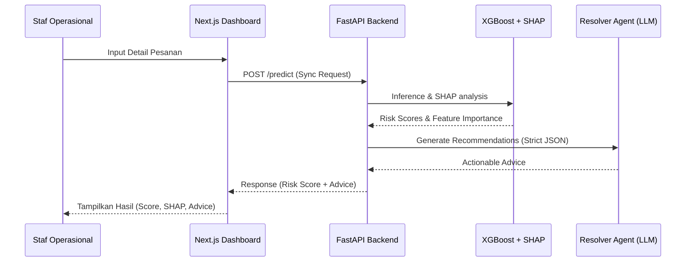
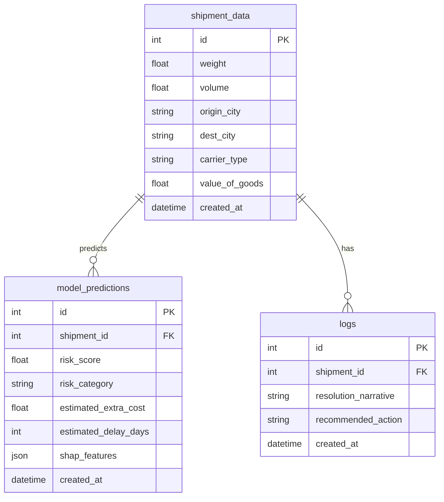

# PRD — JalurAI (Smart Logistics System)

## 1. Overview
JalurAI adalah sistem prediksi risiko logistik berbasis AI yang dirancang untuk mendukung efisiensi biaya distribusi nasional. Masalah utama yang ingin diselesaikan adalah ketidakpastian pengiriman barang (keterlambatan dan *over-cost*) yang selama ini hanya bisa dideteksi setelah kejadian (reaktif).

Tujuan utama sistem adalah menyediakan platform pendukung keputusan bagi staf operasional untuk memprediksi risiko pesanan secara proaktif, memahami penyebab risikonya melalui penjelasan (explainability), dan mendapatkan rekomendasi tindakan yang langsung dapat dijalankan.

## 2. Requirements
Persyaratan tingkat tinggi untuk MVP:
- **Aksesibilitas:** Berbasis Web Browser, diutamakan untuk staf operasional di kantor/gudang.
- **Pengguna:** Staf operasional distribusi dengan fokus pada efisiensi biaya per pesanan.
- **Data Input:** Data historis pengiriman (dimensi, berat, rute, jenis armada) dan input pesanan baru.
- **Explainability:** Sistem harus memberikan konteks (mengapa risiko tinggi), bukan hanya angka probabilitas.
- **Integrasi:** Memanfaatkan arsitektur sinkron (API Request) agar mudah diintegrasikan ke sistem distributor yang sudah ada tanpa infrastruktur kompleks.

## 3. Core Features (MVP)
Fitur kunci yang wajib ada:

1. **Dashboard Prediksi Risiko**
   - Form input data pesanan tunggal.
   - Panel Skor Risiko (Klasifikasi: Risiko Tinggi/Normal).
   - Panel Estimasi Dampak (Regresi: Kelebihan biaya/Keterlambatan).
2. **Layer Explainability (SHAP)**
   - Visualisasi/Narasi 3 fitur utama yang berkontribusi pada skor risiko (misalnya: "Rasio jarak per kg terlalu tinggi").
3. **Resolver Agent (LLM Integration)**
   - Narasi otomatis dalam Bahasa Indonesia untuk staf operasional.
   - Rekomendasi tindakan (misal: "Gunakan ekspedisi alternatif" atau "Gunakan pengiriman via darat").
4. **Rule Engine Safety Net**
   - Pemeriksaan otomatis untuk rute/kondisi kritis yang diketahui.
5. **Logs & Historis**
   - Tabel riwayat prediksi untuk audit kinerja model (monitoring bias).

## 4. User Flow
1. **Input:** Staf memasukkan data pesanan (origin, destination, weight, dimensions, armada).
2. **Processing:** Sistem menjalankan pipeline sinkron (XGBoost Prediction -> SHAP Explanation -> LLM Synthesis).
3. **Review:** Staf melihat skor risiko dan narasi rekomendasi di dashboard.
4. **Action:** Staf mengikuti rekomendasi atau memilih tindakan lain berdasarkan penjelasan yang diberikan sistem.

## 5. Architecture

## 6. Database Schema

## 7. Design & Technical Constraints
1. **Tech Stack:**
   - FastAPI (Python) untuk sinkron API.
   - XGBoost untuk model *in-memory* (efisiensi).
   - Next.js (TypeScript) untuk dashboard operasional.
   - Docker Compose untuk *environment* yang *portable*.

2. **Typography Rules:**
   - **Sans:** `Geist Mono, ui-monospace, monospace`
   - **Serif:** `serif`
   - **Mono:** `JetBrains Mono, monospace`

3. **Performance Requirement:**
   - Prediksi sinkron (Inferensi + SHAP + LLM) wajib selesai < 3 detik untuk menjaga produktivitas staf gudang.
